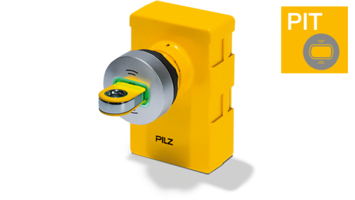

# PILZ PITreader Client Libraries and Examples

PILZ [PITreader](https://www.pilz.com/en-INT/iam) devices are RFID based authentication systems for implementation of industrial access management.

The devices implement three interfaces for integration into other systems:
- REST API (HTTPS)
- Modbus/TCP
- OPC UA Server (only "PITreader S" and "PIT gb RLLE" variants)

This repository contains libraries to connect to the device using the HTTPS REST API and example client applications.

## Documentation

Documentation about the features of the device and publicly available APIs is available in the download section:

- [Operating Manual for PITreader devices](https://www.pilz.com/en-INT/search#SEARCH=1004806&pilz_group_type=download)
- [Operating Manual for the REST API of PITreader devices](https://www.pilz.com/en-INT/search#SEARCH=1005365&pilz_group_type=download)
- [Operating Manual for the OPC UA server of PITreader devices](https://www.pilz.com/en-INT/search#SEARCH=1005480&pilz_group_type=download)

## .NET Library

[Pilz.PITreader.Client](dotnet/PITreaderClient) is a .NET Standard 2.0 library for accessing the REST API of PITreader devices with firmware version 2.0.

In [dotnet/PITreaderTool](dotnet/PITreaderTool) you can find an example application using this library for a number of typical use cases:

- reading and writing transponders (e.g. to "clone" transponders)
- writing and updating user data configuration
- updating the blocklist
- setting the basic coding
- monitoring a device for change
- updating the firmware of a device

## Commissioning and Setup Tool

In [dotnet/PITreaderCommissioningTool](dotnet/PITreaderCommissioningTool) you can find a tool to automate the setup and customization of PITreader devices from unboxing to a fully operational and configured state.

## Support

Please use the issue tracker on this page to ask questions about the libraries and code samples.

If you have any questions about the PITreader devices not specifically related to the library and samples available in this repository you can contact the Pilz Support Hotline: 
- Telephone: +49 711 3409 444
- E-mail: support@pilz.com

## License

Copyright © 2023 Pilz GmbH & Co. KG

Permission is hereby granted, free of charge, to any person obtaining a copy of this software and associated documentation files (the “Software”), to deal in the Software without restriction, including without limitation the rights to use, copy, modify, merge, publish, distribute, sublicense, and/or sell copies of the Software, and to permit persons to whom the Software is furnished to do so, subject to the following conditions:

The above copyright notice and this permission notice shall be included in all copies or substantial portions of the Software.

THE SOFTWARE IS PROVIDED “AS IS”, WITHOUT WARRANTY OF ANY KIND, EXPRESS OR IMPLIED, INCLUDING BUT NOT LIMITED TO THE WARRANTIES OF MERCHANTABILITY, FITNESS FOR A PARTICULAR PURPOSE AND NONINFRINGEMENT. IN NO EVENT SHALL THE AUTHORS OR COPYRIGHT HOLDERS BE LIABLE FOR ANY CLAIM, DAMAGES OR OTHER LIABILITY, WHETHER IN AN ACTION OF CONTRACT, TORT OR OTHERWISE, ARISING FROM, OUT OF OR IN CONNECTION WITH THE SOFTWARE OR THE USE OR OTHER DEALINGS IN THE SOFTWARE.
